# Problem 1: Building Castle In The Cloud

A highly available spot-trading platform on AWS for **500 requests/second** and
**p99 < 100 ms**.

## Assumptions

| Assumption | Value | Why it matters |
|---|---|---|
| Traffic mix | 70 % market data (REST + WebSocket), 30 % order, account and payment | ~150 rps on the write path |
| Concurrent WebSocket connections | 50 000 | Sizes the fan-out tier |
| Client location | Global; the SLO is measured from the platform's region | A percentile needs a measurement point |
| Instruments | Spot only, ~50 symbols in 8 symbol groups | Two-sided transfers only; the group is the write-scaling unit |
| Fixed client IPs | Contractual for some counterparties, not universal | Decides whether static edge IPs are provisioned |
| Teams | auth, payments, trading, recs (recommendation), platform | Namespaces and telemetry tenants |
| Availability / DR | 99.9 % monthly on the order path; RPO ≤ 60 s, RTO ≤ 30 min | 3-AZ everything, warm standby |
| Region | `ap-southeast-1` (Singapore) | Decides which instance families exist |

## Feature scope

| Feature | Service | Team |
|---|---|---|
| Authentication: sessions, WebAuthn/TOTP, signed API requests, step-up on risk | `auth-svc` | auth |
| Location: viewer geography from the edge, jurisdiction rules, impossible travel | `location-svc` | auth |
| Payments: fiat in and out through a provider (PSP), idempotent webhooks | `payment-svc` | payments |
| Crypto wallet: deposit credit, withdrawal intents (Problem 5 moves signing out) | `wallet-svc` | payments |
| Market data: depth, ticker and trades over WebSocket, klines over REST | `market-data-gateway` | trading |
| Orders, matching, ledger, reconciliation | `order-svc`, `matching-svc`, `outbox-relay`, `reconciliation-svc` | trading |
| Recommendation and price: limit price, fill probability, pairs; GPU inference, advisory | `recommendation-price-svc` | recs |

## Architecture



Source: [`diagram.mmd`](diagram.mmd).

## Why each service

| Service | Why |
|---|---|
| **Route 53** — alias to CloudFront, health checks | Native alias records; Shield Advanced protectable |
| **CloudFront** — the **only public surface**: the SPA from a private S3 origin, a 1–5 s cache of public market data, REST and WebSocket pass-through to one private ALB through a **VPC origin**, keep-alive 60 s | One client-facing TLS endpoint and policy, one WAF ACL, Shield Advanced in front of everything, no public origin to bypass to |
| **S3** (private) — the SPA bundle, read by CloudFront through **origin access control** | No public bucket and no website endpoint: the distribution is the only reader, and Problem 4 deploys the bundle by digest |
| **AWS WAF** — one web ACL on CloudFront: managed rule groups, rate-based, geo-match, non-premium bot rules | Every REST request and every WebSocket upgrade crosses it; frames after the upgrade are limited in `market-data-gateway`, not by WAF |
| **Shield Advanced** — on CloudFront and Route 53, automatic layer-7 mitigation enabled on the CloudFront web ACL | Exchanges are a standing DDoS target; response team and cost protection. The private ALB is not separately protected: CloudFront is its only ingress |
| **internal ALB** (VPC origin, `idle_timeout` 120 s) — `/api/*`, `/webhooks/*` → Kong; `/ws/*` → `market-data-gateway` | A service-managed ENI reaches it; it admits only CloudFront's service security group |
| **Kong Gateway OSS** on EKS — HMAC/JWT consumers, Valkey-backed quotas, request limits, Prometheus | In-VPC, no per-request charge, configuration portable to any Kubernetes |
| **EKS** + **Pod Identity** — one namespace per team, one IAM role per service account | Four teams, GPU workloads and per-team isolation are the reasons for Kubernetes; no access keys anywhere |
| **Karpenter** on **m8i** — weighted m8i pool with m7i fallback, plus writer, gateway, GPU and batch pools | Bin-packs to requests, expresses "prefer m8i, fall back" as weights; m8i is the current x86 generation in Singapore |
| **g4dn** (NVIDIA T4) — recommendation inference and training | The mid-range NVIDIA family Singapore offers (below) |
| **KEDA** — consumers on Kafka lag, `market-data-gateway` on connection count | Lag is the only signal that tracks the backlog |
| **Aurora PostgreSQL** + **RDS Proxy** (reads) — source of truth: orders, trades, ledger, outbox | One ACID transaction covers reservation, matching and postings; 3-AZ; the proxy stays off the writer path, where the advisory lock would pin a pooled connection |
| **DynamoDB global table** — the one-second commit beacon `outbox-relay` writes, replicated to the standby region | The only state that has to survive the region it was written in; a global table is the cheapest multi-region write with no operator |
| **ElastiCache Valkey** — book snapshots, sessions, quota counters, features | Sub-millisecond, Multi-AZ, IAM authentication |
| **MSK provisioned** (3 brokers, 3 AZ) + **archive-svc → S3** — the only event transport, hourly Parquet for audit | Per-key ordering plus replay, retention and partitions under my control; Kafka is transport, not an archive |
| **Alloy + YACE, Mimir, ClickHouse, Tempo, Pyroscope, Grafana, Alertmanager → PagerDuty** — a tenant per team in every backend, plus a Grafana organisation per team | The boundary is the backend: `X-Scope-OrgID` per tenant and ClickHouse row policies. The organisation separates dashboards and data sources, not the data |

## Gateway and the public edge

`/api/*` and `/webhooks/*` terminate at **Kong Gateway OSS** in its own namespace and node
pool: three replicas, anti-affinity across AZs, `minAvailable: 2`. Traders are Kong Consumers
with HMAC credentials; Kong identifies the Consumer and applies Valkey-backed quotas
(synchronous counters over IAM authentication for the strict ones), request-size limits and
Prometheus metrics. **The service verifies identity and authorisation itself** and treats
Kong headers as untrusted, so a compromised gateway cannot authorise an order, and
`order-svc` validates payloads against the versioned OpenAPI contract. The Admin API is
ClusterIP-only and configuration is validated in CI and canaried.

**WebSocket** goes from the same ALB straight to `market-data-gateway`. CloudFront passes
upgrades over HTTP/1.1 with the `Sec-WebSocket-*` headers forwarded and WAF inspects the
handshake. Clients send an application-level ping every 30 s and the server answers with a
pong, which keeps both CloudFront's 10-minute origin-to-viewer idle quota and the ALB's
120-second idle timeout alive; a quiet stream would otherwise be closed by the edge. Keeping this path out of the gateway gives it an independent rollout lifecycle: a gateway
upgrade never disconnects 50 000 subscribers.

**Lock-in is deliberate and confined to the edge.** CloudFront, its WAF ACL and the viewer
headers are AWS-specific, which is the price of edge DDoS and bot enforcement; everything
behind the ALB speaks ordinary HTTP and WebSocket and `location-svc` converts those headers
into internal claims, so replacing the edge changes one layer, not the API tier.

**Route 53 geolocation** belongs to a shape this design does not have yet: several regions,
each serving its own tenants, where DNS should answer with the nearest compliant stack. Here
there is one region, `ap-southeast-1`, so CloudFront already picks the nearest edge, a VPC
origin is bound to one ALB, and jurisdiction blocking belongs in WAF geo-match because DNS
answers are advisory.

**Fixed IPs for counterparties that must allowlist us** come from a CloudFront Anycast
static IP list (21 addresses, Price Class All, requested through support, USD 3 000 a month),
provisioned when a contract demands it rather than by default.

## Compute: EKS on m8i, Karpenter, GPU

Three clusters from the same Terraform: **`trading-prod`** (a namespace per team plus
`gateway` and `platform`, the namespace being the root of RBAC, network policy, quotas and
telemetry tenant), **`obs-prod`**, so a workload incident cannot take down the tools used to
diagnose it, and the standby region's cluster described under disaster recovery. Add-ons are pinned on AL2023: VPC CNI with prefix delegation, CoreDNS, EBS CSI,
Pod Identity, Load Balancer Controller, Karpenter, KEDA, Kong Ingress Controller, the NVIDIA
device plugin, External Secrets Operator and Alloy.

| Pool | Instances | Consolidation | Runs |
|---|---|---|---|
| `system` (managed group) | 3 × m8i.xlarge, one per AZ | none | Karpenter, CoreDNS, controllers |
| `general-m8i` (weight 100) | m8i.2xlarge–8xlarge, on-demand | when under-utilised, 10 % budget | stateless services, consumers |
| `general-fallback` (weight 50) | m7i, c8i | same | the same pods when m8i cannot launch |
| `gateway` | m8i.large, one per AZ | when empty, one node at a time | Kong: 3 replicas, anti-affinity, PDB `minAvailable: 2` |
| `netheavy` | m8i.8xlarge+ | when empty | `market-data-gateway`, Alloy gateway |
| `writer` | m8i.2xlarge, tainted, on-demand | **never** outside a weekly window | `matching-svc`, `outbox-relay` |
| `gpu-infer` / `gpu-train` | g4dn.xlarge–2xlarge / g4dn.12xlarge (spot) | when empty | inference / nightly training |
| `batch` | m8i/m7i/c8i spot | aggressive | reconciliation batch, reports |

**Karpenter on the newest CPU generation, reviewed.** Bandwidth is burst below 8xlarge
(m8i lists "up to" there) and the Karpenter label carries the peak, so sustained-traffic pods
are pinned to `netheavy` by **size**. Capacity for the newest family is thinner outside the
US, so the weighted fallback pool absorbs insufficient-capacity errors and pods pending over
two minutes page. Pod density needs the VPC CNI and AMI max-pods table to know the type, so
add-on versions are pinned to releases that list m8i. The writer pool is on-demand with
`expireAfter: Never`, `karpenter.sh/do-not-disrupt` and a zero disruption budget outside its
weekly window, which removes every **voluntary** disruption; node repair, an instance
termination or a manual delete remain possible, so correctness rests on the lock and the
epoch fence rather than on the node surviving.

**GPU in Singapore.** The AWS instance-types-by-Region page lists **G4dn, G5g, Inf1, Inf2
and P4de** for `ap-southeast-1`; G5, G6 and G6e are **not listed**, so
`describe-instance-type-offerings` is re-run before building.

g4dn (NVIDIA T4, 16 GB, x86) is the only mid-range NVIDIA x86 option in the region;
`g4dn.12xlarge` covers training. T4 has no MIG, so inference pods share a GPU by
time-slicing.

## Identity: keyless everywhere

No long-lived AWS access key exists: no IAM user, every principal is a role, and an SCP
denies `iam:CreateUser` and `iam:CreateAccessKey`.

| Principal | Mechanism |
|---|---|
| Every pod | **EKS Pod Identity**: one role per service account, credentials from the node agent, IMDS hop limit 1 |
| Services → Aurora | **IAM database authentication** (15-minute token at connect; RDS Proxy the same); the writer's long-lived session is unaffected |
| Services and Kong → Valkey | **ElastiCache IAM authentication** (Valkey 7.2+, TLS), token re-issued before the 12-hour cut-off |
| Services, KEDA, archive → MSK | **SASL/IAM**; KEDA's `TriggerAuthentication` uses the pod's role |
| Engineers | IAM Identity Center → EKS access entries per namespace; Grafana through the same OIDC provider |
| CI/CD | GitHub OIDC into per-environment roles (Problem 4) |

The secrets that remain (PagerDuty routing keys, PSP credentials, ClickHouse readers,
traders' HMAC secrets) are not AWS credentials: Secrets Manager with rotation, reaching pods
through External Secrets Operator.

## Services and the event backbone

`auth-svc` issues short-lived signed tokens that services verify in process, provisions
traders as Kong Consumers, journals `auth.events` and consumes `risk.signals` for step-up.
`location-svc` reads CloudFront's viewer-location, TLS and fingerprint headers — trusted only
because they arrive through the private VPC origin — and normalises them into
provider-neutral internal fields; hard jurisdiction blocks are WAF geo-match. `payment-svc`
takes PSP webhooks behind a WAF IP allowlist, verifies the signature and **journals the raw
payload in Aurora before acknowledging**: one insert, so a slow ledger never triggers a PSP
retry storm, and durable, unlike producing straight to Kafka, because the relay republishes
it. Settlement applies each once, idempotent on `(psp, event_id)`; chargebacks are reversing
postings and fiat withdrawals go to the Problem 5 policy engine.
`recommendation-price-svc` runs a features consumer, GPU inference and nightly training;
predictions carry a model version and `as_of` and are advisory.

| Topic | Key | Partitions | Producer → consumers | Use case |
|---|---|---|---|---|
| `market.trades`, `market.book-deltas`, `orders.events` | symbol | 24 | `outbox-relay` → `market-data-gateway` (one group per pod), `recs-features`, `archive-svc` | fan-out, features, audit |
| `ledger.entries`, `payments.settled` | account_id | 12 | `outbox-relay` → `archive-svc`, notifications | audit, notification |
| `payments.webhooks` | payment_id | 12 | `outbox-relay` (from the journal `payment-svc` wrote) → `payment-svc` worker | buffered idempotent settlement |
| `auth.events` | account_id | 12 | `outbox-relay` (from the journal `auth-svc` wrote) → `location-svc`, `wallet-svc` (24-hour withdrawal lock after a credential change), `archive-svc` | risk, lock enforcement |
| `risk.signals` | account_id | 12 | `location-svc` **directly** → `auth-svc` (step-up), `order-svc` (jurisdiction block) | soft controls; **advisory and recomputable**, so losing them costs nothing that was promised |
| `recs.prices` | symbol | 12 | `recs-inference` **directly** → `market-data-gateway`, `archive-svc` | display, model audit; advisory, regenerated by the next inference pass |

MSK provisioned: 3 brokers in 3 AZs, replication factor 3, `min.insync.replicas=2`,
idempotent producers with `acks=all`, IAM auth, TLS, 7-day retention. The invariant is
narrow and checkable: **anything a caller has been told was accepted reaches Kafka only
through the outbox relay**, journaled in Aurora first, so those topics are rebuildable by
replay and none of them exists only in Kafka. The two advisory streams above are produced
directly and recomputed rather than replayed, which the table marks. Telemetry is not on
this backbone.

**Scaling on lag.** Every consumer group except the fan-out gateway is a KEDA
`ScaledObject` on the Kafka scaler (`sasl: oauthbearer`, `saslTokenProvider: aws_msk_iam`,
`tls: enable`, `awsRegion`, `TriggerAuthentication` with `podIdentity.provider: aws`, whose role is attached to the
`keda-operator` service account, because the scaler authenticates as the operator),
`minReplicaCount: 2`, a `lagThreshold` per group, replicas capped at the partition count.
`market-data-gateway` scales on connections per pod (target 5 000) behind a pod disruption
budget; `outbox-relay` is one fenced owner per stream and scales by adding streams; Kong
scales on CPU, active requests and proxy latency. Lag over budget for five minutes is a
ticket; lag over budget **at `maxReplicaCount`** is a page, because only adding partitions
(a planned migration) fixes it.

## The order path: how money stays correct

**One fenced writer per symbol group.** `matching-svc` is a Deployment with `replicas: 1`
and `strategy: Recreate` on the `writer` pool. On start it takes
`pg_advisory_lock(hash(symbol_group))` on a dedicated writer connection and increments an
`epoch` in `shard_leader`; every write transaction re-reads it and aborts on a mismatch, so a
stalled old leader is fenced by data, not by a timeout. Before taking work it replays open
orders into its book and reconciles against `symbol_seq`, else it comes up cancels-only and
pages. `Recreate` stops a rollout from overlapping, but it proves nothing during a node or
control-plane partition: the safety property is the advisory lock plus the epoch fence, and a
partitioned-node resurrection test exercises exactly that.

**One transaction per command:**

```
BEGIN                                        -- READ COMMITTED
  UPDATE balances SET available = available - :amt, reserved = reserved + :amt
   WHERE account_id = :acct AND asset = :asset AND available >= :amt
  RETURNING *;                               -- 0 rows -> reject: insufficient funds
  -- rows locked in (account_id, asset) order; risk checks; match the in-memory book
  INSERT INTO trades ...;  UPDATE orders SET filled_qty = ..., status = ...;
  INSERT INTO ledger_entries ...;            -- base and quote legs for both sides, plus fees
  UPDATE symbol_seq SET last = last + 1 WHERE symbol = :sym RETURNING last;
  INSERT INTO events (symbol, seq, payload) VALUES (...);   -- the outbox
COMMIT                                       -- only now is the order acknowledged
```

`40001`/`40P01` are retried with backoff; `(account_id, client_order_id)` is unique, so a
duplicate returns the committed result; cancel is idempotent. `outbox-relay` reads `events`
in `seq` order, publishes with the stream key as partition key and advances `published_upto`
only after the broker acknowledges: at-least-once delivery of an exactly-once commit;
consumers deduplicate on `(key, seq)` and replay gaps.

**Invariants**, checked continuously by `reconciliation-svc`: Σ debits = Σ credits per asset;
every balance equals its journal; every trade has all its postings; `events.seq` contiguous
per stream; `orders.filled_qty` equals its trades; daily, fiat movements match the PSP
settlement report. A violation trips the **kill switch**; repair is a runbook with two-person
approval. Market integrity adds self-trade prevention, price collars, per-account rate limits
and a surveillance feed.

## Observability: one team cannot see another's data

Namespace decides the tenant (`auth`, `payments`, `trading`, `recs`, `gateway`, `platform`).

| Signal | Store | Tenant set by | Boundary |
|---|---|---|---|
| Metrics | Mimir | An Alloy pipeline per team, filtered on namespace | Per-tenant storage and query |
| Logs | ClickHouse | OpenTelemetry Collector; `k8s.namespace.name` → `team` | `ROW POLICY ... USING team = 'auth'`, a read-only user per team |
| Traces | Tempo | The namespace's Alloy gateway sets the tenant header | Per tenant; cross-team traces only in `platform` |
| Profiles | Pyroscope | `pyroscope.ebpf` + `pyroscope.write` per team | Per tenant |

**Grafana** is OSS with one **organisation per team** plus platform, users mapped by OIDC
group (`org_mapping`). An organisation isolates Grafana's own objects, not the data behind
them, so the boundary is two other things: data sources provisioned per organisation as
**fixed, non-editable** entries carrying that team's tenant header, and the backends
themselves refusing another tenant — per-tenant storage in Mimir, Tempo and Pyroscope, and
ClickHouse row policies on every node with no read path to an unprotected raw table.
Cross-team dashboards live only in the platform organisation. PII is scrubbed in Alloy.

**Alerting.** Each team owns its rules and Alertmanager config in Git, loaded into its Mimir
tenant with `mimirtool`; a tenant without config falls back to the platform default.
`critical` → PagerDuty Events API v2 with the team's routing key, `warning` → Slack, and a
`Watchdog` alert on an external heartbeat monitor pages when alerting itself dies.
Page-critical alerts (order p99, writer lock lost, kill switch, outbox backlog, lag at max
replicas, PSP reconciliation break, Kong 5xx) read in-cluster metrics; YACE metrics arrive
minutes late and drive capacity alerts only.

## Latency and capacity

**Boundary:** a load generator on EC2 in `ap-southeast-1` against the public order hostname,
first byte to last byte; a second generator inside the VPC hits the internal ALB so the
edge's share is measured. **Acceptance:** p99 < 100 ms at 500 rps with the 70/30 mix for
30 minutes, trace breakdown attached, failover reported separately. Planning budget per component, not summed (percentiles do not add):
ALB ≤ 2 ms, Kong ≤ 3 ms, `order-svc` ≤ 10 ms, Aurora transaction ≤ 25 ms, acknowledgement
≤ 3 ms, reserve ≤ 47 ms. AWS publishes no figure for the edge hop, so the public-to-ALB delta
is **measured**, not budgeted, with REST tested on warm and cold origin connections because
the 60-second keep-alive is a tuning choice, not a guarantee. The writer is Go, Rust or
low-pause Java in a Guaranteed QoS pod on its own node, and fault injection covers every row
of the table below.

## Failure modes

| Failure | Behaviour | Recovery |
|---|---|---|
| One AZ lost | Pods reschedule; Aurora, Valkey, MSK are 3-AZ | Automatic; pools sized N+1 by AZ |
| `matching-svc` pod dies, or an old writer resurrects | The shard **rejects new orders and cancels** with a retryable error (a cancel is a write); a resurrected writer aborts on the epoch check | New pod takes the lock, bumps the epoch, resumes from committed state |
| Aurora writer failover | **Fail closed** for orders and cancels; market data from cache | Reader promoted; idempotent retries |
| Outbox relay or MSK down | Ledger unaffected, and the PSP is **not** asked to redeliver: its webhook was acknowledged once the journal insert committed. Fan-out lags with a staleness warning; the advisory streams stop | Replay from `events` and the journal; advisory streams are recomputed |
| Kong pod lost / unavailable / misconfigured | Two replicas serve; REST fails closed if none; open WebSockets continue; bad pods never become ready | Replacement in another AZ; roll back from pinned manifests |
| Kong compromised | Gateway traffic is exposed, but service authorisation still holds and no store but the quota Valkey is reachable | Isolate the namespace, revoke trader credentials, redeploy |
| Valkey unavailable | Blast radius by workload, which is why they are separate replication groups: **quotas** fail closed on programmatic order routes and open on public reads under WAF limits; **sessions** force reauthentication; **book snapshots** are rebuilt from `events` and served with a staleness header until they are; **recommendation features** degrade to advisory-unavailable | Multi-AZ failover per group; service-side limits remain in force meanwhile |
| CloudFront misconfigured | The surface behaves wrongly with **no public bypass** to work around | Roll back the distribution to the previous configuration |
| CloudFront itself unavailable | Nothing is reachable, by design: there is no second public surface | **Accepted**: wait for AWS. The Shield response team is a DDoS mechanism, not an outage channel, so there is no faster path than AWS's own recovery |
| Logical corruption from a bad release, a defective transaction or an operator | Global Database replicates it, so the standby is **not** an escape: the kill switch stops new orders | Restore PITR into an isolated cluster, compare against PSP settlement and chain receipts, replay the good interval under two-person approval, run the invariants, and only then reopen writes |
| Edge or origin failure with open WebSockets | Connections are **not migrated**: they close and clients reconnect | The client resumes from its last `(key, seq)` or takes a fresh snapshot; `market-data-gateway` is sized for the reconnect wave |
| Invariant violation | Kill switch on the symbol or asset | Manual repair with approval |
| Region lost | Warm standby promoted | Below |

An unavailable write path **fails closed for orders and cancels** and queues neither: a
silently queued cancel is worse than a rejection.

## High availability and disaster recovery

Everything spans three AZs. Aurora Global Database replicates **asynchronously** to
`ap-southeast-2`, so a regional failure **can lose committed transactions**: the RPO is the
replication lag at promotion, alarmed on `AuroraGlobalDBRPOLag`, with a documented cutoff above which promotion
becomes a business decision. The ≤ 60 s objective is proven in a quarterly drill.

**The standby runs a serving stack**, not just a database: its own EKS cluster with the
system pool, **two replicas each of Kong, `market-data-gateway` and `order-svc`**, and
`matching-svc` and `outbox-relay` **deployed but quiescent** — they hold no advisory lock and
take no work while the secondary is read-only, and start only when promotion bumps the epoch
— plus a pre-created internal ALB registered as a second CloudFront VPC origin and its own
Valkey groups and MSK. Both the `/api/*` and `/ws/*` behaviours are pre-configured for that
origin, so promotion flips them rather than creating them.

Its read state is warm because **MSK Replicator mirrors the market topics** into the standby
cluster continuously, and the standby's own `market-data-gateway` consumes them to maintain
its Valkey book snapshots. Without that, automatic read failover would answer from an empty
cache; with it, a reader gets data that is stale by the replication lag and marked as such.
The replication traffic is the cross-region line in the cost table, and the standing capacity
is the standby line.

Failover is split by method, because the edge can only fail over safely for reads:

- **Read-only market-data behaviours** (`GET`, `HEAD`, `OPTIONS`) use a CloudFront origin
  group, primary and standby, set to **one attempt with a two-second connection timeout**, so
  a dead origin costs two seconds instead of the 30 s default. This is the only automatic
  part, and it serves stale-but-marked data from the standby's cache and book snapshots.
- **Writes are fenced before anything is promoted**, because cross-region fencing during an
  Aurora failover is best-effort. The order is: close the write path (kill switch on, `/api/*`
  returning 503 at the edge); confirm the old region's writers can no longer reach the
  database, by revoked access or conclusive isolation; **then** promote, bump the
  `shard_leader` epoch so a surviving old writer aborts on its next transaction, start the
  standby's writer, and only then repoint `/api/*` **and** `/ws/*`. A request that slips
  through during propagation cannot commit to a discarded primary. DNS does not change.
- **WebSocket clients reconnect** after promotion and resume from their sequence number.

Propagation of the distribution update is asynchronous with no published bound, so the drill
measures it and the measurement counts inside the 30-minute RTO.

**Recovery of state.** Every authoritative inbound event is journaled in Aurora **before it
is acknowledged** and published by the outbox relay, so it survives with the database and a
lost MSK cluster costs only fan-out; MSK is rebuilt by replaying `events`. Restorable backups are
**cluster snapshots copied to the standby region by an AWS Backup cross-Region copy plan** —
Aurora does not support cross-Region automated backup replication, so the copy is the
mechanism — and not snapshot exports, which write Parquet to S3 for analytics and cannot be
restored into Aurora. Restores are
tested monthly and end with the reconciliation invariants, which prove the restored state is
*consistent*, not *complete*.

Completeness needs a witness outside the failed region, and putting one on the acknowledgement
path would add a cross-region round trip to every order, so the witness is a **beacon**: once
a second, `outbox-relay` writes the highest committed `(symbol_group, seq)` and a timestamp to
a DynamoDB global table whose replica lives in the standby region. At promotion the loss is
**at least** `max(0, beacon_seq − promoted_seq)` per symbol group. That floor is the part we
observe; the rest is **unobserved**, because commits made after the last beacon that
replicated left no witness at all and DynamoDB's cross-region replication is asynchronous
with no published latency SLA. A fresh beacon bounds the **time window** in which those
commits could have happened, not how many there were. So promotion has a gate: if the newest
beacon replica is **older than five seconds**, even that window is unknown and promotion
becomes a business decision rather than an operational one. The reconciliation run then proves that whatever survived is consistent.
A business that needs zero loss needs a different design, and this is where that shows.

## Cost

Order of magnitude, `ap-southeast-1`, on-demand, **pay-as-you-go** list prices before
Savings Plans or a negotiated plan, excluding S3 and PagerDuty seats:

| Line | USD / month |
|---|---|
| EKS control planes × 3 (trading, observability, standby) | ~220 |
| `system` 3 × m8i.xlarge in each of the two primary-region clusters | ~1 000 |
| `general` ~6 × m8i.2xlarge, `writer` 2 × m8i.2xlarge, `gateway` 3 × m8i.large, `netheavy` 2 × m8i.4xlarge, + ALB | ~5 400 |
| Balloon headroom for spikes (one AZ's serving capacity, always running) | ~1 200 |
| `gpu-infer` 2 × g4dn.xlarge | ~1 000 |
| Observability cluster (ClickHouse 3 × m8i.2xlarge + gp3, Mimir/Tempo/Pyroscope/Grafana ~3 × m8i.2xlarge) | ~3 000 |
| Aurora 3 × r7g.large + storage and I/O; MSK 3 × kafka.m7g.large; Valkey replication groups | ~2 800 |
| Standby region: system pool, 2 × (Kong, gateway, order-svc), a quiescent `matching-svc` and `outbox-relay` on one m8i.2xlarge, ALB, Aurora secondary, its own Valkey and MSK | ~4 000 |
| DynamoDB global table for the commit beacon: 8 symbol groups × 1 write/s = **20.7 million write units a month in each** of `ap-southeast-1` and `ap-southeast-2`. Since the November 2024 change a replicated write is priced like a standard write, so at AWS's published on-demand example of USD 0.625 per million this is ≈ USD 26; both regions' rates are above the US example, so confirm them at build time | ~30 |
| CloudFront HTTPS requests at 500 rps (~1.3 billion), viewer geography decides the rate; the WAF ACL itself is covered by Shield Advanced's standard allowance | ~1 300–2 800 |
| Shield Advanced (one-year commitment) | 3 000 + its own USD 0.025/GB transfer fee |
| CloudFront data transfer out, and cross-region replication for Aurora, MSK and images | modelled from measured bytes, not estimated here |
| CloudFront Anycast static IP list | **not in the baseline**: +3 000 only if a counterparty contract requires fixed IPs |

Roughly **USD 23 000–25 000 a month before data transfer out**, which the WebSocket fan-out
dominates and only a load test can size; fetches from an AWS origin are free, so that bill is
edge-to-viewer only. The standby region, Shield Advanced and self-hosted observability are
the largest discretionary lines, and each is the price of a stated requirement: a 30-minute
RTO, a DDoS target, per-team telemetry isolation. Levers: Savings Plans, a negotiated
CloudFront plan at this volume, a higher edge hit ratio, m8g for observability, spot for
training and batch, and a thinner standby if the business accepts a longer RTO.

## Absorbing spikes without going down

Traffic arrives in bursts and replica counts react too slowly: Karpenter needs a node boot,
HPA a metrics window. Capacity is bought **before** the spike, and when it runs out the
platform degrades in an order chosen in advance.

- **Standing headroom.** Each scalable pool runs balloon pods at a negative priority class,
  sized to one AZ's serving capacity, with a one-second `terminationGracePeriodSeconds`.
  Preemption plus the new pod's readiness is an **acceptance condition of the soak test**
  rather than a number this document can quote, and the running replicas have to carry the
  load for that interval: headroom removes the node boot from the path, not the process start.
- **Scheduled pre-scaling.** A KEDA cron trigger returns a scheduled `desiredReplicas` for
  known windows, which is the effective floor while the window is active.
- **Buffers before anything that can queue.** MSK already absorbs fan-out, features and
  webhook settlement, so a burst lands in the log, not on a service; CloudFront's 1–5 s cache
  with request collapsing turns a spike of identical public reads into one origin request;
  `market-data-gateway` admits new connections through a token bucket and **rejects** the
  excess with `429` and a `Retry-After` the client jitters, rather than holding thousands of
  pending upgrades that would consume memory and hit the edge's timeouts anyway.
- **Signals that track work, not CPU.** Kafka lag, connections per pod, Kong active requests
  and proxy latency; scale-up may double in one step, scale-down is slow.
- **The writer's queue is bounded and split by priority.** Cancels have a reserved lane, and
  new orders are rejected as soon as the predicted queue delay approaches the p99 budget
  rather than being admitted and timing out. When the writer or the database is unavailable,
  cancels fail closed like everything else: the lane protects them from overload, not from an
  outage.
- **Shedding order.** Recommendations first (advisory), then kline and history reads, then
  public depth served stale with a staleness header, then new WebSocket subscriptions, then
  non-order REST. **Orders keep their capacity and cancels keep their reserved lane**; Kong
  returns `429` with `Retry-After` per Consumer.

The acceptance suite proves it: 500 → 2 500 rps in 30 s plus a 20 000-connection reconnect
wave, passing only if the order path holds its SLO and only the chosen categories shed.

## Scaling plan

Each step fires on a **measured** threshold from the load and soak tests.

1. **More reads or WebSocket clients** → longer CloudFront TTLs, more Aurora readers and
   Valkey shards; KEDA adds `market-data-gateway` pods on `netheavy`.
2. **More API traffic** → more Kong replicas and gateway nodes, with the headroom above
   raised in step.
3. **Consumer lag at max replicas** → add partitions as a planned migration.
4. **More order throughput** → more symbol groups, each with its own fenced writer: the only
   axis that preserves correctness.
5. **One symbol saturates its writer** → batching, a tighter hot path, a larger m8i size,
   then one Aurora cluster per symbol group with history in DynamoDB. Sharding stays at
   whole-symbol-group granularity, which is what preserves price-time priority.
6. **Geographic growth** → a read-mostly second region behind a second VPC origin, serving
   the read-only origin group under the same hostname, WAF ACL and Shield protection; write
   routing changes only after a writer promotion and reconciliation.
7. **GPU demand** → more `gpu-infer` nodes, then Inf2 once models are stable.
8. **Sub-millisecond matching** → a Raft-replicated in-memory engine becomes the writer.
