# Problem 2: Diagnose Me Doctor

An Ubuntu 24.04 VM with 64 GB of storage, whose only job is to run NGINX as a load balancer
in front of upstream services, is reporting **99 % disk usage** continuously.

## Assumptions

- The brief says "two production issues" but describes one scenario, so this answers the
  scenario given and does not invent a second.
- **Which filesystem is full comes from the alert, not from a guess.** The monitoring label
  names a mountpoint; `df -hT` and `findmnt` confirm it. A separately mounted `/var/log` can
  be full while `/` looks healthy, and `du -x` on `/` would never show it.
- A monitoring percentage is rounded, so "99 % continuously" does **not** prove the usage
  has plateaued. The trend and the absolute free bytes decide whether this is still growing.
- The VM is in service and taking live traffic. Nothing below destroys state before it is
  captured, and no command may make a struggling box worse.
- Work happens in a root shell (`sudo -i`): `dmesg`, per-process descriptors and log reads
  are all incomplete as a normal user.
- [`diagnose.sh`](diagnose.sh) automates Phase 1. It contains no recovery command and no
  command that writes, mounts or signals anything; it reports what it could not collect and
  exits non-zero when the collection has gaps.

## Two facts that set the order of work

**A full disk on an NGINX load balancer is usually not an outage yet.** NGINX keeps proxying
traffic when it cannot write a log line. What breaks is everything else: a reload or a
configuration test fails, certificate renewal fails, `apt` fails, a new SSH session may fail,
and the next configuration change becomes impossible. The first question is therefore whether
traffic is still flowing, not what to delete.

**`rm` on a file NGINX still has open frees no space at all**, and it destroys the only
record of why the disk filled. Evidence is preserved, and verified, before anything is
cleaned up.

## Troubleshooting flow



Source: [`decision-tree.mmd`](decision-tree.mmd).

### Phase 0 — triage and safety (5 minutes)

If SSH itself hangs or drops, that is already a data point rather than an obstacle: a root
filesystem at 100 % can stop `sshd` and PAM writing session and auth records, and some
configurations refuse the login rather than proceed. Go in on the provider's serial or VNC
console instead, and treat everything below as running there.

```bash
ALERT_PATH=/var/log                                  # whatever the alert names
MOUNT="$(findmnt -no TARGET --target "$ALERT_PATH")"  # resolved once, used everywhere
findmnt -no TARGET,SOURCE,FSTYPE,OPTIONS --target "$ALERT_PATH"
df -hT -x tmpfs -x devtmpfs      # every filesystem: which one is actually full
df -i "$MOUNT"                   # bytes or inodes? both fail with ENOSPC
systemctl status nginx
# The real listener, with the real hostname, so TLS and SNI are exercised too.
curl -sS -m 3 -o /dev/null -w '%{http_code}\n' \
     --resolve 'api.example.com:443:127.0.0.1' https://api.example.com/<health path>
dmesg --level=err,warn | tail    # I/O errors, or a filesystem remounted read-only
```

Decide two things: **is traffic still flowing** (if not, drain or fail over this load
balancer before diagnosing), and **is this a capacity problem at all** — a read-only or
erroring filesystem is a storage fault wearing a capacity costume. Confirm serving from the
outside too: the upstream 5xx rate and request rate in monitoring, not only a local `curl`.
`$MOUNT` from this step is the target for every walk, every `du`, and any growth in Phase 3;
on a box with a separate `/var` or `/var/log`, using `/` instead would inspect and grow the
wrong device.

`nginx -t` and `nginx -T` are **not** part of triage: loading the running configuration can
open, and create, the files it names. The configuration is read from disk
(`grep -Rn ... /etc/nginx`) until there is free space again.

### Phase 0b — preserve evidence, and prove it landed

Write nothing to the full filesystem: on a 99 % disk, `> /tmp/evidence.gz` is how a full
disk becomes an outage, because `/tmp` is usually the same filesystem. Each artifact is
staged in **memory** (`/dev/shm`, sized well under free RAM), verified there, copied off-box
and verified again. Nothing in Phase 3 runs until this sequence has exited zero.

```bash
set -euo pipefail                    # any failure stops the sequence
INCIDENT="inc-$(date -u +%Y%m%dT%H%M%SZ)"
STAGE="/dev/shm/${INCIDENT}"
mkdir -p "$STAGE"
trap 'rm -rf "$STAGE"' EXIT       # the stage lives until the shell exits, not until line N
ssh bastion "mkdir -p /incident/${INCIDENT}"
LOGDIR=/var/log/nginx             # from the configuration grep in Phase 0, not from $MOUNT

capture() {                          # capture <name> <command...>
  local name="$1"; shift
  local staged="${STAGE}/${name}.gz"
  "$@" | gzip -c > "$staged"                       # pipefail covers producer and gzip
  local bytes sum remote_bytes remote_sum
  bytes="$(gunzip -c "$staged" | wc -c)"           # decompressed size, not the gzip size
  ((bytes > 0)) || { echo "EMPTY CAPTURE: ${name}" >&2; return 1; }
  sum="$(gunzip -c "$staged" | sha256sum | cut -d" " -f1)"
  scp -q "$staged" "bastion:/incident/${INCIDENT}/"
  remote_bytes="$(ssh bastion "gunzip -c /incident/${INCIDENT}/${name}.gz | wc -c")"
  remote_sum="$(ssh bastion "gunzip -c /incident/${INCIDENT}/${name}.gz | sha256sum | cut -d' ' -f1")"
  [[ "$bytes" == "$remote_bytes" && "$sum" == "$remote_sum" ]] ||
    { echo "TRANSFER MISMATCH: ${name}" >&2; return 1; }
  printf 'verified %-24s %10s bytes  %s\n' "$name" "$bytes" "$sum"
}

capture access  tail -n 200000 "${LOGDIR}/access.log"
capture error   tail -n 20000  "${LOGDIR}/error.log"
capture config  tar -C /etc -c nginx logrotate.d logrotate.conf
capture journal journalctl -u nginx --since -2h
# The archive must also be a readable archive, not just a valid gzip stream.
ssh bastion "gunzip -c /incident/${INCIDENT}/config.gz | tar -t > /dev/null"

echo "EVIDENCE VERIFIED in /incident/${INCIDENT}"   # only now may Phase 3 begin
```

**A deleted-but-open file is captured the same way, once Phase 1 has found it**, because it
is the one artifact that `nginx -s reopen` destroys. Phase 1's `lsof` prints the device and
inode as well as the pid and descriptor: capture **once per unique device+inode**, not once
per holder, since several NGINX workers share the same file. The capture is bounded, because
this is the file that filled the disk and the staging area is memory — the tail is what
explains the growth:

```bash
# 512 MB from the end of one deleted inode, through any one holder's descriptor.
capture deleted-dev8-1-ino4711 tail -c 536870912 /proc/1234/fd/7
```

The staging directory is removed by the `EXIT` trap, so it is still there when Phase 1 comes
back with those numbers.

If there is no route off the box, the same function works against an attached volume or
object storage (`aws s3 cp -`, if the CLI is already installed — see the tooling note
below). A few hundred thousand log lines explain the growth: this is a sample, not an
archive, and it has to fit in the memory staging area.

### Phase 1 — locate the space (10 minutes)

The first fork is **whether `du` agrees with `df`** on the alerted filesystem:

```bash
nice -n 19 ionice -c3 du -xsh "$MOUNT"     # -x stays on one filesystem
df -h "$MOUNT"
```

- **`du` much smaller than `df`** → the space belongs to files that are deleted but still
  open, or hidden under a mount point, or reserved blocks:

  ```bash
  lsof -nP -a +L1 "$MOUNT" -F pcfDisn   # this filesystem only: pid, command, fd, device, inode, size, name
  find /proc/[0-9]*/fd -lname '*(deleted)*'          # same evidence without lsof
  tune2fs -l "$(findmnt -no SOURCE --target "$MOUNT")" | grep -i 'reserved block'
  ```

  Key unique usage by **device plus inode**, not inode alone: inode numbers repeat across
  filesystems. List every holder, because reopening or truncating needs the right pid and
  descriptor, and a file can be held by several processes.

- **They agree** → the files are really there:

  ```bash
  nice -n 19 ionice -c3 du -xh --max-depth=1 "$MOUNT" | sort -h | tail -15
  nice -n 19 ionice -c3 find "$MOUNT" -xdev -type f -size +200M -printf '%10s %p\n' | sort -rn | awk 'NR<=15'
  ```

`nice`/`ionice` and `-xdev` keep the diagnosis from becoming the incident.
[`diagnose.sh`](diagnose.sh) runs this whole set in one pass, against the same resolved
mount: `sudo ./diagnose.sh "$ALERT_PATH"`.

**Tooling on a minimal Noble host.** `curl`, `lsof`, `tune2fs` (`e2fsprogs`), `vgs`/`lvs` (`lvm2`),
`growpart` (`cloud-guest-utils`), `parted`, `sfdisk` (`fdisk`), `xfs_growfs` (`xfsprogs`),
`coredumpctl` (`systemd-coredump`) and the AWS CLI are **not** guaranteed to be present, and
`apt-get install` on a 99 % disk is exactly what tips the box over. Check with `command -v`,
use the `/proc` fallbacks above, and install only after Phase 3 has freed space — or from a
prepared image next time.

## Phase 2 — causes, most likely first

Every row states the impact and a recovery that preserves evidence first. The top two account
for most real incidents on a box whose only job is load balancing.

| # | Cause | Signs | Impact | Recovery, after evidence is verified off-box |
|---|---|---|---|---|
| 1 | **Access and error logs growing without bound.** A load balancer logs every request for every upstream: verbose `log_format`, `error_log` left at `debug`, health checks logged, a path no `logrotate` rule matches, or `logrotate` not running. A scan, bot or retry storm is a trigger of this row, not a separate cause | `/var/log/nginx` dominates `du`; `logrotate` state for nginx is old or absent; request rate up | NGINX still serves, but reload, `-t`, certificate renewal and `apt` fail; disk I/O rises; one change away from an outage | Rotate **only if** there is room for the compressed copy, then `nginx -s reopen`; otherwise free space first (Phase 3). Then fix the cause: `error_log … warn`, buffered logging, stop logging health checks, rate-limit the abusive source |
| 2 | **Logs rotated or deleted while NGINX holds them open.** `rm` on a big log, or a `logrotate` rule with no `postrotate` signal | `du` far smaller than `df`; `lsof +L1` shows `(deleted)` files with large sizes | The same, plus the space is invisible: nobody can see the files using it | Capture the bounded sample through the descriptor (Phase 0b), then `nginx -s reopen`, which frees the inode and **discards whatever was not copied** — that is the deliberate trade, sample kept, remainder gone. Then confirm `df`. Only if another process holds it and cannot be signalled: `truncate -s 0 /proc/<pid>/fd/<fd>`, which destroys the data. Fix `logrotate` |
| 3 | **The filesystem is smaller than the disk.** The volume was resized to 64 GB; the partition or logical volume never was | `lsblk` shows unallocated space, or `vgs` shows free extents | Writes are failing now, exactly as in row 1, and the usual remedies delete data that did not need deleting | Grow it (commands below), on `$MOUNT`'s device, after confirming a snapshot or backup exists. The only recovery that adds space instead of removing data |
| 4 | **NGINX proxy and body temporary files.** With `proxy_buffering on`, a response over the buffers spills to `proxy_temp_path` up to `proxy_max_temp_file_size` (1024 MiB per response by default); uploads land in `client_body_temp_path`, a separate mechanism | `/var/lib/nginx/proxy` or `/var/lib/nginx/body` grows with traffic and shrinks when it drops | 500/502 whenever a temporary file cannot be created, so it is a partial outage while it lasts, plus latency from disk I/O | Immediate relief comes from stopping the spill, not from deleting files, which NGINX still holds open: rate-limit or temporarily route away the endpoint serving the large responses or uploads, and confirm the directory drains as requests finish. Then cap it: `proxy_max_temp_file_size 0` streams to the client instead (real backpressure, a trade-off), `client_max_body_size` bounds uploads, or the temp paths move to their own volume. That configuration change is the one legitimate reason to reload |
| 5 | **A persistent `proxy_cache_path` with no `max_size`.** A cache grows to fill the disk by design; the cache manager only enforces a limit that exists | The configured cache directory dominates `du`; the directive has no `max_size` | Cache writes fail and upstream load rises; NGINX still proxies, but the disk stays full and every other write is at risk | Set `max_size` and `inactive`, reload, and let the cache manager evict. Clearing by hand desynchronises the in-memory index, so if it must be cleared, **drain or fail over this load balancer first**, then stop NGINX, clear the directory and start it |
| 6 | **OS logs and failed rotation.** `syslog`, `auth.log` or a shipping agent's spool, and a `logrotate` run that has been failing silently | `/var/log/*.log` large outside `nginx/`; no recent `logrotate` state entries; `logrotate` errors in the journal | Same class of failure, and it hides the NGINX signal | Fix the rotation config, rotate with headroom, then bound the shipper's buffer. Run `logrotate -d /etc/logrotate.conf` to prove the whole config parses |
| 7 | **Journal duplication.** `SystemMaxUse` defaults to the smaller of 10 % of the filesystem and 4 GiB (`RuntimeMaxUse` when volatile). NGINX lines in the journal mean it was configured to log to stderr or syslog as well, so every line is stored twice | `journalctl --disk-usage` is large; `/var/log/journal` in `du`; nginx lines in `journalctl -u nginx` | Double storage for the same data | Export what is needed first: `--vacuum-size` deletes **archived** journals only and may not reach the target, and it does not touch the active file. Then set `SystemMaxUse=`/`SystemKeepFree=` under `/etc/systemd/journald.conf.d/` and restart `systemd-journald` |
| 8 | **Core dumps and crash reports.** `/var/lib/systemd/coredump` or `/var/crash` | Multi-gigabyte files there; repeated worker crashes in the journal | Writes fail as in row 1, and the crashes themselves mean workers are restarting, so capacity and latency are already degraded | Keep one dump off-box as the evidence for the crash, remove the rest, then cap with `MaxUse=`/`KeepFree=` in `coredump.conf` (`Storage=` only chooses where dumps go, it does not cap them; `coredumpctl` needs the `systemd-coredump` package). The crash is a separate investigation that this recovery must not erase |
| 9 | **Package cache, old kernels, snap revisions** | `/var/cache/apt`, several `linux-image-*`, disabled snap revisions | Writes fail as in row 1, while the space holding the box hostage is safely reclaimable | `apt-get clean` first (it removes only downloaded archives), then `apt autoremove --purge` for old kernels once there is room for `dpkg` to run, keeping the running kernel and one known-good fallback. Ubuntu 24.04 already keeps two snap revisions, so check before assuming |
| 10 | **Inode exhaustion rather than bytes.** Millions of small files in a cache, session store or agent spool | `df -h` has space, `df -i` is at 100 %, writes fail with ENOSPC | Every write fails although the disk has free bytes, and deleting large files changes nothing. Row 3 does help here: growing ext4 adds block groups, each carrying an inode table at the ratio chosen at `mkfs` time, so the inode count rises in proportion — measured, 256 MiB with 65 536 inodes became 1 GiB with 262 144. What is fixed is the ratio, not the count, so raising the ceiling *without* adding space needs a reformat at a smaller `-i`, or XFS, which allocates inodes on demand | Identify the producer first (`find "$MOUNT" -xdev -type d -printf '%p\n' | awk 'NR<=20'`, then count per directory) and confirm the files are disposable — a session store or a spool that has not shipped yet is not. Then delete in real batches that pause between them, so the box stays responsive: `find … -mtime +N -print0 \| nice -n 19 ionice -c3 xargs -0 -r -n 500 sh -c 'rm -- "$@"; rc=$?; sleep 1; exit $rc' _`, so a failed batch still fails. Then change what produces them |
| 11 | **Space hidden under a mount point, or reserved blocks.** Files written to a directory that was later used as a mountpoint; or ext4's 5 % root reserve | `du` and `df` disagree with no deleted-open files; `tune2fs -l` shows the reserve | Writes fail as in row 1, and because the space cannot be found by walking the tree, the pressure pushes people into deleting the wrong things | Bind-mount the filesystem elsewhere (`mount --bind "$MOUNT" /mnt/fscheck`) to see the shadowed files, and remove them only after the same evidence step. Lower the reserve with `tune2fs -m 1` only as a deliberate, documented change, never as the first move |
| 12 | **Storage or filesystem fault, not capacity.** I/O errors, or the filesystem remounted read-only | `dmesg` errors; `ro` in the mount options; writes fail even though `df` shows space | Writes fail everywhere; treating it as a capacity problem makes it worse | Do not remount read-write to "fix" it, and do not run a repair on a mounted filesystem. Drain or fail over this load balancer, keep the diagnostics (`dmesg`, SMART/NVMe logs), snapshot the volume, then run the filesystem-specific checker unmounted — from rescue media, or with the volume attached to another instance. Replacing the instance from an image is usually faster |
| 13 | **Someone left a file there.** A tarball, a database dump, a `tcpdump` capture in `/root` or `/home` | One huge file outside the service paths | Writes fail as in row 1, for something no service needs | Confirm with the owner that it is disposable, move it to object storage, then delete it. Future captures go to a separate capped volume, a size-limited tmpfs, or straight to object storage through a pipe — never to `/tmp` on the full filesystem |

The two recoveries worth spelling out:

```bash
# Cause 2 — release deleted-but-open logs (after the Phase 0b sample; the uncopied tail is lost)
nginx -s reopen                  # or: kill -USR1 "$(cat /run/nginx.pid)"
df -h "$MOUNT"                   # the space returns immediately

# Cause 3 — grow the filesystem THAT IS FULL (identify device and type first)
findmnt -no SOURCE,FSTYPE --target "$MOUNT"   # e.g. /dev/nvme0n1p1 ext4, or a dm- device
growpart /dev/nvme0n1 1                       # cloud-guest-utils; parted/sfdisk otherwise
resize2fs /dev/nvme0n1p1                      # ext4: takes the DEVICE
xfs_growfs "$MOUNT"                           # XFS: takes the MOUNT POINT
lvextend -r -L +20G /dev/mapper/vg-root       # LVM: a measured amount, not +100%FREE
```

And the change to Ubuntu's **existing** `/etc/logrotate.d/nginx` that bounds retention. Edit
that file rather than replacing it, and change only the retention: the packaged
`invoke-rc.d nginx rotate` already sends `USR1` after checking the pid file and the process,
so replacing it with a bare `kill` would lose those checks.

```diff
 /var/log/nginx/*.log {
         daily
         missingok
-        rotate 14
+        rotate 7
         compress
         delaycompress
         notifempty
         create 0640 www-data adm
         sharedscripts
         prerotate
                 if [ -d /etc/logrotate.d/httpd-prerotate ]; then \
                         run-parts /etc/logrotate.d/httpd-prerotate; \
                 fi \
         endscript
         postrotate
                 invoke-rc.d nginx rotate >/dev/null 2>&1
         endscript
 }
```

Everything else is exactly as the package ships it. If a host has no rule for nginx at all —
which `diagnose.sh` reports as a finding — add the packaged rule rather than inventing one.
Prove the whole configuration still parses with `logrotate -d /etc/logrotate.conf`, and note
that logrotate has no inline comments, so nothing can be annotated inside the file.

`[ -f … ] && kill …` would exit non-zero when the pid file is absent and make the whole
rotation look failed; the form above exits zero.

`-d` is the limit of what a dry run proves: it parses every rule and prints the plan, and it
deliberately does **not** rotate or run `postrotate` — it says so itself, `not running
postrotate script, since no logs were rotated` — so it cannot show that NGINX reopened
anything. The bug in cause 2 lives precisely in that gap. Testing it needs a real rotation on
a disposable host — a staging instance or a copy of the image, never this one mid-incident:

[`rotate-check.sh`](rotate-check.sh) is that test, and it **asserts** rather than reports: it
records the inode, forces the rotation, waits for the signal NGINX handles asynchronously, and
exits non-zero unless the path moved to a new inode, every NGINX descriptor on an access log
is on that new inode, and the file grows after a request. It reads the descriptors by walking
`/proc/<pid>/fd`, because a failed reopen leaves NGINX on the renamed but still-linked
`access.log.1`, which `lsof +L1` cannot see.

Measured on Ubuntu 24.04 with the packaged NGINX, three rules in one run:

| `postrotate` | inode moved | NGINX holds | exit |
|---|---|---|---|
| signals NGINX | 1798001 → 1798015 | `access.log` at 1798015, 85 bytes | 0 |
| packaged rule, its signal unable to run | 1798001 → 1798014 | `access.log.1` at 1798001 | 1 |
| absent | 1798001 → 1798014 | `access.log.1` at 1798001 | 1 |

The inode moved in all three, which is why checking only that proves nothing. The descriptor
is what separates a working rotation from cause 2, reproduced deliberately in the last two
rows.

The check belongs in the image build, so a broken `postrotate` fails a pipeline instead of a
disk.

## Phase 3 — recovery order

Least destructive first, and each step conditional on the one before:

1. **Verify the evidence is off-box** (Phase 0b). Nothing below is reversible.
2. **Reopen descriptors** (`nginx -s reopen`) when Phase 1 found deleted-but-open files:
   instant and it frees real space, at the cost of the part of those files that step 1 did
   not copy. The bounded sample is the evidence; the rest is deliberately discarded.
3. **Grow the filesystem** when `lsblk`/`vgs` showed unused capacity: the only step that adds
   space rather than removing data.
4. **Remove genuinely disposable data** — package cache, old dumps, old kernels, snap
   revisions — never application or audit data.
5. **Compress or rotate** only once there is measured headroom for the compressed copy;
   forcing rotation on a full disk can consume the last free blocks.
6. **Truncate as a last resort**: instant, and it destroys the log. Only with the sample
   already verified off-box, and recorded in the incident notes.
7. **Verify without changing anything**: `df -h`, `df -i`, the upstream 5xx rate and latency
   back at baseline. **No reload** — a reload activates whatever configuration is on disk,
   including edits nobody intended to ship. Reload only after a deliberate configuration
   change, and then only after `nginx -t` passes on a filesystem with free space.

## Phase 4 — prevention

The underlying problem is that a load balancer is storing data it should only be forwarding.

- **Ship logs off-box** (CloudWatch Agent, Fluent Bit, Vector) with a small local buffer and
  a hard cap. The box keeps hours of logs, not months.
- **Log less on purpose**: sample successful requests, exclude health checks, keep
  `error_log` at `warn`, use buffered writes.
- **Rotate correctly**: daily, seven copies, compressed, with a `postrotate` signal, proven by
  a forced rotation on a disposable host rather than by `logrotate -d`, which never runs the
  script it is supposed to be testing.
- **Cap everything that grows**: `SystemMaxUse` for journald, `max_size` for every
  `proxy_cache_path`, a bound on `proxy_max_temp_file_size`, `MaxUse=` for core dumps.
- **Give `/var/log` its own volume**, so a log flood degrades logging instead of taking
  certificate renewal, `apt` and SSH down with it.
- **Alert earlier and on the right thing**: warn at 80 % used, page on predicted exhaustion
  (`predict_linear(node_filesystem_avail_bytes[6h], 6*3600) < 0`), alert on **inodes**
  separately, and alert on log bytes per second — the metric that would have shown this
  coming.
