# Problem 5: Fortify The Castle

Security for the [Problem 1](../problem1/SOLUTION.md) platform, built into the
architecture. Markers: 🔴 **design changed**, 🟠 **control added, implementable today**,
🟡 **required before launch, not yet built**, ⚪ **risk accepted for now**. Anything
unmarked, and grey in the diagram, is Problem 1 unchanged.

## Priorities

Controls are ranked by **how permanent the loss is**, not by checklist coverage: a stolen
database row can be re-secured, a signed withdrawal cannot be recalled.

- **Refuse to ship without** — stops irreversible loss of funds or makes an intrusion
  detectable and attributable.
- **Accepted or deferred** — named, with the trade-off and what would reverse it.

Reference incident: Bybit, February 2025, about $1.5 billion. Not a break of the exchange
infrastructure or of cryptography: a compromised **developer machine and credentials at the
third-party wallet provider** served approvers a deceptive transaction. The surface that
matters is **the signing path, the people on it and the tooling they trust**.

## Threat model

| Asset | Threat | Adversary |
|---|---|---|
| Customer funds (crypto and fiat) | Fraudulent or altered withdrawal or payout; signing-path compromise | State-sponsored crews, insiders |
| Ledger and matching integrity | Unauthorised writes, replay, history tampering | Insider with database access, compromised service |
| Customer accounts | Credential stuffing, SIM swap, session theft | Commodity criminals at scale |
| PII, KYC, card data | Bulk exfiltration, regulatory breach | Criminals, insiders |
| Availability | L3/L4 and L7 DDoS, WebSocket floods | Extortion, market manipulation |
| Build pipeline and cluster | Supply-chain compromise, CI credential theft, a poisoned image or gateway config | The Bybit vector |
| Cross-team data | One team reading another's logs, traces or features | Insider, compromised engineer account |

The matching engine holds no keys, so confidential computing for it is deferred: the host,
cluster and database controls below cover the order and position data it does hold.

## Updated architecture

Source: [`diagram-secure.mmd`](diagram-secure.mmd) (Mermaid).

## What changed in the Problem 1 design (🔴)

1. **Custody leaves the platform.** A qualified third-party custodian holds 100 % of the
   signing keys or key shares; the exchange holds **none**, so the platform cannot sign a
   transfer itself or bypass the policy the custodian holds independently. The only
   credential on our side is a **scoped API authentication key** to the custodian's
   policy-gated API: a stolen key can ask for a transfer that the custodian's own limits,
   allowlist and approval quorum still have to pass, which is the point of registering the
   policy on both sides.
   Accepted trade-off: vendor concentration, handled in change 3.
2. **Withdrawals and fiat payouts get their own trust domain.** Account `prod-custody` runs
   only the **withdrawal-policy-engine**; `wallet-svc` and `payment-svc` may only raise
   intents. Trading reaches it over a **cross-account PrivateLink endpoint**, and the engine
   authenticates the calling workload cryptographically rather than by network position,
   because a security group proves only which ENI connected. Egress leaves through a
   **forward proxy with an FQDN allowlist** (custodian, PSP, AML provider, chain sources) and
   nowhere else, since security groups cannot express hostnames; the proxy logs every call.
   State machine `requested → screened → policy_checked → approved → submitted → signed |
   instructed → confirmed → reconciled`: every transition audited, every state timed out, no
   blind retries. Policy is enforced on our side **and** registered independently with the
   custodian: per-user, per-day and global caps; a destination allowlist with a **24-hour
   delay**; velocity and anomaly rules from `risk.signals`; **quorum approval** above a
   threshold by named people with hardware keys; fail closed on any engine error.
   **Independent transaction verification**: approvers confirm destination, asset, amount
   and calldata **derived from the exact unsigned payload**, on the custodian's own channel
   and hardware display, never on our UI; disagreement kills the transaction and opens an
   incident. **Separation of duties on the signing path is enforced, not assumed**: policy
   administrator, allowlist editor, approver and API-credential custodian are four distinct
   roles and no person holds two; policy and allowlist changes need two named approvers and
   take effect only after a cooling period; privileged access is just-in-time and time-boxed;
   every change lands in the immutable log. So the administrator who could weaken a limit
   cannot approve the transfer that exploits it. Requests are idempotent and replay-guarded
   by nonce and expiry; callbacks are signature-verified and matched to a request we made; a
   timed-out request is reconciled by query, never resent. Hot float =
   `min(percentage cap, stressed demand over the custodian's replenishment window)`.
3. **Vendor outage and exit are executable.** Contractual key and asset succession plus an
   emergency transfer authority; a second custodian onboarded warm with addresses already
   allowlisted; an annual exit drill moving real value; during an outage, withdrawals
   suspended, deposits held as pending credit under a written exposure cap, trading on
   finalised balances continues.
4. **Card data never enters the platform.** **Every** element of the payment form is served
   by the PSP, as a redirect or an iframe we do not script into; we hold tokens only. That is
   what makes PCI DSS **SAQ A** the validation route we aim for, with ASV scanning of the
   pages that load the PSP's form, and, for the iframe variant, the confirmation about
   script attacks that the criteria require. The acquirer and a QSA decide the route, not us:
   if any payment element ends up served by our own pages, the answer is SAQ A-EP or SAQ D
   depending on the remaining criteria. Webhooks: PSP IP allowlist at WAF, signature
   verified, idempotent on `(psp, event_id)`.
5. **Deposits get a state machine and a second opinion.** Idempotent on `(chain, txid,
   index)`; `observed → pending → confirmed (N per chain) → credited`; deep reorg reverses or
   freezes and goes to review; **two independent chain sources**, disagreement holds.
6. **Assets are reconciled against liabilities continuously and formally.** Every signing
   request is preceded by a balance and exposure check, and an **independent monitor** polls
   on-chain and custodian balances every few minutes against expected movement, so a drain
   is caught in minutes rather than at the next cut-off. The formal daily reconciliation
   (custodian statements, on-chain balances and the PSP settlement report against the
   customer-liability ledger) stays as the complete check. Either one breaking trips the
   withdrawal kill switch.
7. **One public surface, private everything else.** Problem 1 already made CloudFront the
   only public surface with one internal ALB as a VPC origin (Kong for REST, direct to the
   market-data gateway for WebSocket, no shared origin secret). This adds: private EKS API
   endpoint; no public IPs and no internet route in app and data subnets; AWS APIs through
   VPC endpoints, not NAT; security groups referencing **pod** security groups (below), never
   CIDRs; TLS on every hop.

## What was added (🟠 / 🟡)

### Refuse to ship without

| Control | Protects against | Why this tier |
|---|---|---|
| **Identity baseline**: Organizations with trading / custody / security accounts; Identity Center with hardware MFA; **no IAM users or access keys**; SCPs denying `iam:CreateUser`, `iam:CreateAccessKey`, CloudTrail tampering and unused regions; audited break-glass | Credential theft, lateral movement, escalation | Everything rests on it, and account separation is painful to retrofit |
| **Kubernetes hardening**: Pod Security Standards `restricted`; Pod Identity with IMDS hop limit 1; access entries per namespace; **NetworkPolicy default-deny per namespace**; Kyverno blocking privileged, `hostPath` and mutable tags everywhere, allowing **only our registry** in application namespaces, and allowing a named list of vendor registries in the add-on namespaces (`ci/policy/`); GuardDuty EKS Protection and Runtime Monitoring; EKS audit logs archived | A compromised pod reaching other teams, the node role or the cluster API | Four teams share one cluster; the namespace boundary must be enforced on day one |
| **Security Groups for Pods**: `matching-svc`, `outbox-relay`, `wallet-svc`, `payment-svc`, `auth-svc`, `reconciliation-svc` and the archive consumer each get their own group via `SecurityGroupPolicy`; Aurora, Valkey and MSK admit **those groups only**, never the node group. `ENABLE_POD_ENI` on a pinned CNI version, enforcing mode `standard` (required alongside NetworkPolicy and NodeLocal DNSCache), private subnets, a branch ENI per pod counted against `max-pods`. Three limits are designed around rather than discovered: the feature needs a **trunk-capable** instance type, so every m8i size in use is validated for trunking and branch-ENI capacity; the `terminationGracePeriodSeconds` restriction is CNI-version-specific and verified against the pinned version; and with the CNI's default `AWS_VPC_K8S_CNI_EXTERNALSNAT=false` a pod's traffic leaving the VPC is source-NATed to the node and carries the **node's** group, so external egress is governed by the proxy in change 2, not by the pod group. The CNI version is pinned in the cluster's add-on configuration and both behaviours are re-verified whenever it is bumped | A compromised pod on the same node (market data, recommendations) opening a connection to the ledger database: by default every ENI carries the node's groups, so the data tier would trust every pod on every node | NetworkPolicy governs traffic inside the cluster; the data stores sit outside it and see only security groups |
| **Authorisation inside the stores, not just reachability**: a written service-to-store matrix enforced as **per-service PostgreSQL roles** (`order-svc` and `matching-svc` write orders, trades and the ledger; `reconciliation-svc` reads and writes nothing; everyone else is denied the ledger), an **append-only `ledger_entries`** with `UPDATE` and `DELETE` revoked and a trigger that rejects them, no DDL for any application role (migrations run as Problem 4's separate migrator), **per-service `kafka-cluster` IAM policies** scoped to exact topic, group and transactional-id ARNs — MSK IAM authorisation does not read Kafka ACLs — **Valkey users with per-user access strings**, and immutable, restore-tested backups | An insider or compromised service with a valid connection rewriting history, reading another team's topic or deleting the evidence. Pod groups and IAM authentication decide **who may connect**, not what the connection may do | A ledger that can be silently edited is not a ledger |
| **Gateway containment**: Kong in its own namespace and node pool, no AWS permission beyond the quota cache, Admin API ClusterIP-only and denied from product namespaces, config validated in CI and canaried; services verify identity themselves and treat Kong headers as untrusted | A compromised or misconfigured gateway becoming a path to the data tier, or an authority services trust | The gateway runs inside the workload cluster, so its blast radius has to be bounded explicitly |
| **Secrets management**: Secrets Manager with rotation, delivered by External Secrets Operator into namespace-scoped Secrets; nothing in code, images or CI variables | The most common real breach path | Problem 3 showed hard-coded credentials; the pattern must be impossible |
| **Immutable audit**: organisation CloudTrail to S3 in the log-archive account under **Object Lock compliance mode for seven years** (beyond the five-year AML record-keeping obligation), **digest-file validation** (which covers CloudTrail and nothing else) with an alarm when it fails; EKS control-plane audit logs go to CloudWatch Logs, and a **subscription filter into a delivery stream** writes them continuously to the same bucket (a subscription filter cannot target S3 directly), locked for one year, their integrity resting on the bucket rather than on digests; versioning on; the KMS key administered by a different principal with a scheduled-deletion alarm | An attacker deleting their tracks | Governance mode is bypassable and a destroyed key makes logs unreadable. Being precise about which log is cryptographically validated, and for how long each is kept, avoids a false sense of coverage |
| **Detection and response on day one**: GuardDuty, Security Hub, Config, Inspector, alerts into a PagerDuty security service, **IR runbooks rehearsed in a tabletop** | Slow detection turning an intrusion into a catastrophe | An exchange without a paged security on-call is choosing not to notice |
| **Customer account security**: mandatory 2FA (WebAuthn/TOTP), anti-phishing code, device binding, scoped API keys with IP allowlists, step-up from `risk.signals`, per-account rate limits, and a **24-hour withdrawal lock after any credential change**, applied equally to **recovery, MFA reset and device re-enrolment**. Recovery is held to the same assurance as login, never a weaker fallback; support staff cannot reset MFA or edit an allowlist, only raise a request the same quorum approves; sessions and API keys are revoked on any sensitive change, with notice through an independent channel | Account takeover, whose usual route is the recovery flow or the help desk, not the login form | Mandatory 2FA that a phone call can reset is not mandatory 2FA |
| **Edge protection**: WAF managed, rate-based, geo-match and bot rules; **Shield Advanced** on CloudFront and Route 53 with automatic layer-7 mitigation on the web ACL; HSTS, strict CSP, and origin access control on the private S3 origin that serves the SPA; no public origin exists. WAF inspects only the first **16 KB** of a request body by default (64 KB is the CloudFront maximum), so oversize bodies are set to **match and block**, Kong caps API bodies below that limit, and the service validates the whole payload itself | DDoS extortion, credential stuffing, injection, direct-to-origin bypass | Exchanges are a standing DDoS target. The body limit matters: an injection payload past 16 KB is invisible to WAF, so the gateway and the service are the real boundary, and WAF is depth, not the only layer |
| **Pipeline integrity** ([Problem 4](../problem4/SOLUTION.md)): shared templates, OIDC only, SHA-pinned actions, quality gate, SBOM, **keyless signature and provenance** on every artifact, deploy by digest after verifying both | The Bybit vector: a developer machine or pipeline altering what users run or sign | The signing identity is the shared build workflow, so an ad-hoc build cannot impersonate it |
| 🟡 **Admission policy** in the cluster: every image by digest; application images only from our registry **and** carrying a signature and provenance from the Problem 4 identity; add-on images only from a named vendor list. Specified in `ci/policy/`, **not deployed or integration-tested** | The same vector at the last hop: an unsigned or foreign image reaching a node | The pipeline proves what was built; the cluster must refuse anything else, or the proof is decorative. Vendor add-ons cannot carry our signature, so they are bounded by registry and digest instead, which is the honest limit of this control |
| **Telemetry isolation** ([Problem 1](../problem1/SOLUTION.md)): a tenant per team for metrics, logs, traces and profiles, a Grafana organisation per team, PII scrubbed at the collector | An insider or compromised engineer reading another team's data; PII leaking through logs | Logs are the easiest place to find a customer identifier and the least guarded |
| **AML/CFT programme, not a screening step**: KYC and due diligence at onboarding with beneficial-owner identification and PEP screening, sanctions screening of customers and counterparties, ongoing transaction monitoring with blockchain analytics on deposit and withdrawal addresses, enhanced measures for unhosted wallets, alert case management, suspicious-transaction reporting, and the originator and beneficiary data the local notice requires for institution-to-institution transfers | Laundering conduit, licence loss, personal liability | Screening alone catches the named adversary and misses the pattern; an operator is examined on the programme, not on a list lookup |
| **Independent penetration test before the account and custody paths open**: recovery and help-desk flows, API authorisation and key scoping, the withdrawal policy engine and its approval path, the custodian integration, administrative access, and attempts to bypass the pipeline and admission controls; critical and high findings fixed and independently retested | A design reviewed only on paper, on the two paths where a mistake is irreversible | A bug bounty finds what a test misses, but it starts after launch and cannot be the first look at the signing path |
| **Encryption with customer managed keys**: CMK per data class, envelope encryption for PII and KYC, key policies separating use from administration | Bulk data theft, insider access to raw PII | KYC data is a permanent liability once leaked |

## Accepted risk (⚪)

| Risk accepted | Why it is acceptable now | What would reverse it |
|---|---|---|
| Service-to-service mTLS with workload identity | NetworkPolicy, pod security groups, Pod Identity and TLS to every store are the day-one substitute: network authorisation, not workload identity. I accept the weaker service identity for a bounded period, not as a closed gap | A compliance finding, or a third party on the shared network, pulls it forward |
| Multi-region active-active | Warm standby; a regional failure **can lose committed transactions up to the replication lag**, the same non-zero RPO as Problem 1 | A regulatory requirement or a target above 99.95 % |
| WAF inspection of WebSocket frames | WAF sees the handshake only; message-level abuse is limited per connection and account in `market-data-gateway` | Evidence of message-level abuse in the surveillance feed |
| Confidential computing for the matching engine | It holds no keys, and order data in use is covered by the host, cluster and database controls | The engine holding key material, or a regulator requiring memory-level isolation |
| SOC 2 / ISO 27001 at launch | Controls first, certification after; a report is not a control | A customer or regulator requiring it |
| ML fraud detection | Rule-based velocity and anomaly checks first: explainable and tunable on day one | Enough labelled fraud data to beat the rules |
| Self-custody, on-premises HSMs | The custodian runs a physical key programme we would take years to match. The residual risk is real and not removed by the exit protocol: theft at the custodian, its insolvency, or loss of a share still costs us the assets, so due diligence (licence, legal segregation of client assets, insolvency treatment, who owns the key shares, sub-custodian controls, insurance limits) and independent on-chain balance monitoring are the mitigation | Custodian fees exceeding a proper internal security programme, and the team to run it |
